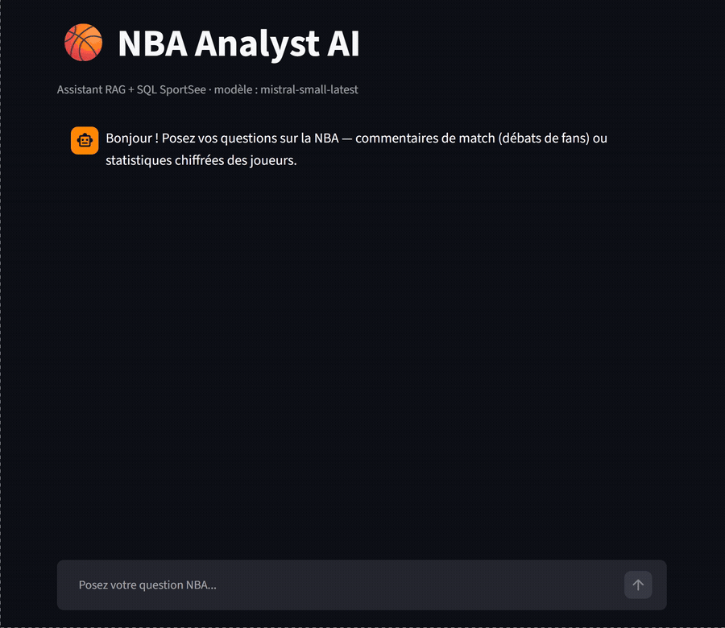
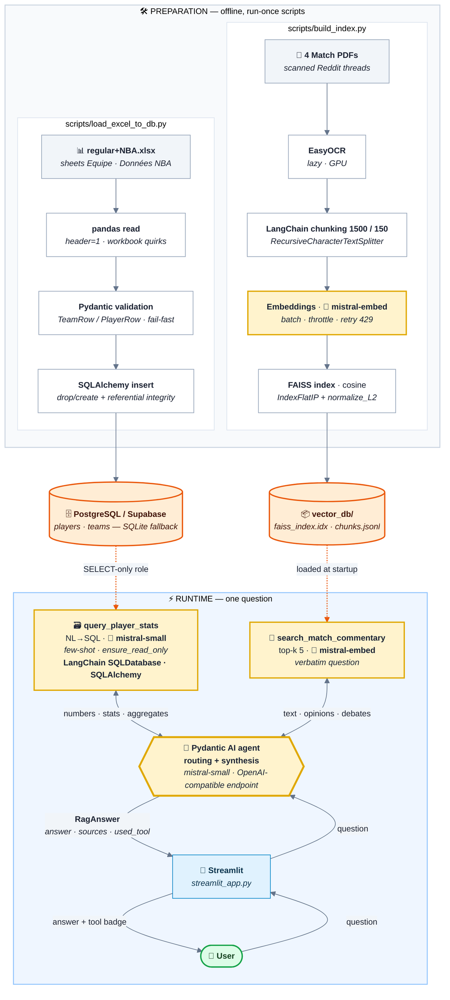

<a id="readme-top"></a>

<div align="center">

# NBA Analyst AI — SportSee

**A RAG + SQL conversational assistant, objectively evaluated with RAGAS**
*OpenClassrooms project P10 — "Evaluate the performance of an LLM"*

[](https://www.python.org/)
[](https://docs.astral.sh/uv/)
[](https://ai.pydantic.dev/)
[](https://mistral.ai/)
[](https://docs.ragas.io/)

**Answer faithfulness ×2.5, context precision ×4.3** — measured by RAGAS across
60 business questions, by replacing text retrieval over numerical data with a
**SQL tool** routed by an **agent**.

### [🏀 Try the live app](https://ocp10ragnba-comments-and-stats-h8erxkzbpxjzfbzwzg7yx2.streamlit.app/) &nbsp;|&nbsp; [📊 Read the evaluation report](https://kl38.github.io/OC_P10_RAG_NBA-comments-and-stats/)

*No install needed: chat with the deployed agent, or browse per-category radars
and a question-by-question verdict for the three systems compared.*

</div>

<div align="center">
  
  <br />
  <em>One question, both tools: what fans say about a player comes from the PDF
  corpus, his 3-point percentage from SQL — and the answer names its sources.</em>
</div>

---

## 📊 Results

Mean RAGAS scores (60 questions, excluding the `out_of_scope` category,
judge `mistral-small`) — prototype vs. final agent:

| Metric | Prototype (baseline) | RAG + SQL agent (v2) | Δ |
|---|---:|---:|---:|
| `faithfulness` | 0.36 | **0.88** | **×2.5** |
| `context_precision` | 0.17 | **0.71** | **×4.3** |
| `context_recall` | 0.26 | **0.76** | **×2.9** |
| `answer_relevancy` | 0.76 | **0.83** | +0.07 |

Three systems were measured, to isolate each effect:

- **`baseline`** — text-only RAG with the Excel flattened into the index
  (reproduces the prototype's bug);
- **`enriched`** — RAG + SQL agent over the full index: isolates **what the SQL
  tool contributes**;
- **`enriched_v2`** — same agent over a **PDF-only** index (the Excel is now
  reachable through SQL alone) plus a **scope guard**: the reference run.

➡️ **[Full report: per-category radars and question-by-question verdicts](https://kl38.github.io/OC_P10_RAG_NBA-comments-and-stats/)**
— also available as a file in [`eval/reports/`](eval/reports/).

---

<details>
<summary>📑 Table of contents</summary>

- [Results](#-results)
- [About the project](#-about-the-project)
- [Architecture](#-architecture)
- [Getting started](#-getting-started)
- [Usage](#-usage)
- [RAGAS evaluation](#-ragas-evaluation)
- [Tests](#-tests)
- [Repository layout](#-repository-layout)
- [Known limitations](#-known-limitations)

</details>

## 📌 About the project

SportSee has a prototype NBA assistant that answers *textual* questions well
(fan debates) but **fails on numerical ones**: the Excel statistics, flattened
into text and then split into chunks, are unreadable to semantic retrieval.

This repository covers the full cycle the brief asks for:

1. **Audit** the prototype with a **RAGAS** evaluation harness (60 business
   questions, 6 categories: textual, simple/complex numerical, noisy,
   out-of-scope, mixed);
2. **Extend** the system: a SQL database validated by **Pydantic** plus an
   **NL→SQL** tool (LangChain), routed by a **Pydantic AI agent**;
3. **Re-evaluate** with the same harness and analyse the before/after delta,
   traced step by step in **Logfire**.

Two data sources, two tools:

| Source | Content | Tool |
|---|---|---|
| `Match 1-4.pdf` | Reddit fan threads (scans → OCR) | 🔎 RAG (FAISS, cosine) |
| `regular+NBA.xlsx` | one regular season of stats (569 players) | 🗃️ SQL (SELECT only) |

For every question the agent decides on its own which tool to query — RAG, SQL,
or both — and answers **only** from what they return.

<p align="right">(<a href="#readme-top">back to top</a>)</p>

## 🏗️ Architecture



> 🟡 yellow node = Mistral call · 🟠 orange cylinder = persistent storage ·
> orange dashes = artefact built offline, consumed at runtime.

**Database security**: the application runs under a **SELECT-only** role
(`DATABASE_URL_READONLY`); only the loading script uses the admin role. Defence
in depth (application guard + PostgreSQL role), verified by
[`scripts/check_db_readonly.py`](scripts/check_db_readonly.py).

### Stack

Python 3.12 · UV · Pydantic AI · Mistral · FAISS · LangChain (`SQLDatabase`) ·
SQLAlchemy · PostgreSQL/Supabase (SQLite fallback) · RAGAS · Pydantic Logfire ·
Streamlit · EasyOCR/PyTorch.

<p align="right">(<a href="#readme-top">back to top</a>)</p>

## 🚀 Getting started

> **On reproducibility.** The source files (four scanned match PDFs and the
> season workbook) are OpenClassrooms coursework material and are **not
> redistributed here**: `data/` and `db/` are git-ignored, and `vector_db/` only
> holds the PDF-only index the deployed app needs. The steps below therefore
> document the pipeline rather than offer a clone-and-run path. To judge the
> outcome without running anything, **[try the live app](https://ocp10ragnba-comments-and-stats-h8erxkzbpxjzfbzwzg7yx2.streamlit.app/)**
> or read **[the evaluation report](https://kl38.github.io/OC_P10_RAG_NBA-comments-and-stats/)**.

### Prerequisites

- **Python 3.12** and **[UV](https://docs.astral.sh/uv/)**
- A **Mistral API key** (free tier) — <https://console.mistral.ai/>
- *(optional)* a **CUDA GPU**: speeds up OCR at indexing time (CPU works, slower)
- *(optional)* a **Supabase / PostgreSQL** project: otherwise the project falls
  back to local SQLite automatically

### Installation

```powershell
# 1. Dependencies (reproducible environment)
uv sync

# 2. Secrets: copy the template and fill in the Mistral key
Copy-Item .env.example .env
# then edit .env → MISTRAL_API_KEY=...  (every other variable is optional)
```

| Variable (`.env`) | Required | Role |
|---|---|---|
| `MISTRAL_API_KEY` | ✅ | generation, embeddings, RAGAS judge |
| `DATABASE_URL` | ⚪ | **admin** role — Excel → SQL loading only |
| `DATABASE_URL_READONLY` | ⚪ | **SELECT-only** role — application runtime |
| `LOGFIRE_TOKEN` | ⚪ | cloud traces (otherwise Logfire runs locally) |

> Without `DATABASE_URL`, the project falls back to a local **SQLite** database
> (`db/nba.sqlite`) — handy for offline testing.

### Build the artefacts

```powershell
# 3. Build the vector index (PDF OCR + embeddings)
# full index (PDF + flattened Excel) — required for the baseline/enriched RAGAS runs:
uv run python scripts/build_index.py
# PDF-only index — required by the Streamlit app and the enriched_v2 run:
uv run python scripts/build_index.py --pdf-only

# 4. Load the Excel stats into the SQL database
uv run python scripts/load_excel_to_db.py

# (optional) check that the application role really is read-only
uv run python scripts/check_db_readonly.py
```

<p align="right">(<a href="#readme-top">back to top</a>)</p>

## 💬 Usage

```powershell
# Chat interface (recommended)
uv run streamlit run streamlit_app.py

# …or from the command line, for a one-off question
uv run python scripts/ask.py "Which teams impressed in the playoffs?"
```

Every answer shows **which tool was used** (RAG, SQL, both — or none, flagged as
an answer without evidence) together with its **sources**.

## 📏 RAGAS evaluation

```powershell
# Original prototype (text-only RAG, Excel flattened into the index)
uv run python eval/evaluate_ragas.py --system baseline

# RAG + SQL agent over the full index
uv run python eval/evaluate_ragas.py --system enriched

# RAG + SQL agent over the PDF-only index + scope guard (reference run)
# → needs the PDF-only index: build_index.py --pdf-only (see above)
uv run python eval/evaluate_ragas.py --system enriched_v2

# Add --limit 2 for a quick smoke run (2 questions)
```

The harness is **strictly identical** across the three systems (same questions,
same judge, same metrics): only the `--system` flag changes, so the delta
measures the system and not the protocol. Each run writes a JSON report and a
Markdown table to [`eval/reports/`](eval/reports/).

## 🧪 Tests

```powershell
uv run pytest
```

A pragmatic split: everything deterministic (SQL schema, guards, parsing, agent
routing) is covered by unit tests; LLM calls are mocked (Pydantic AI's
`TestModel`, injected fakes) — no test touches the network.

<p align="right">(<a href="#readme-top">back to top</a>)</p>

## 🗂️ Repository layout

```
src/sportsee_rag/
  ingestion/     corpus loading & parsing (PDF/OCR, Excel, docx)
  retrieval/     FAISS index (cosine) + search
  rag/           RAG pipeline (retrieve → prompt → answer)
  sql/           schema, Excel→SQL loading, SQL tool (SELECT-only)
  agent/         Pydantic AI agent (RAG / SQL routing)
  llm/           Mistral client (retry/backoff)
  config.py      typed configuration (pydantic-settings)
  observability  Logfire
scripts/         entrypoints: build_index, load_excel_to_db, ask, check_db_readonly
eval/            RAGAS harness, questions.yaml, reports & comparisons
docs/            published evaluation report (GitHub Pages)
tests/           offline unit tests (pytest)
data/            source corpus — git-ignored, not redistributed
```

## ⚠️ Known limitations

- **Match PDFs are OCR'd scans** (Reddit threads): the text is noisy by nature,
  which caps some context metrics even when the answer is correct.
- **The RAGAS judge is `mistral-small`** (free tier), not a frontier model: the
  scores are *indicative*; the reliable signal is the **delta** from baseline to
  enriched.
- **Scope is a single season of aggregated totals**: the source data carries no
  temporal dimension and no per-match detail, so the schema stops at `teams` +
  `players`, and out-of-schema questions (per match, home/away, salaries…) are
  **refused** by the agent rather than invented.

<p align="right">(<a href="#readme-top">back to top</a>)</p>
